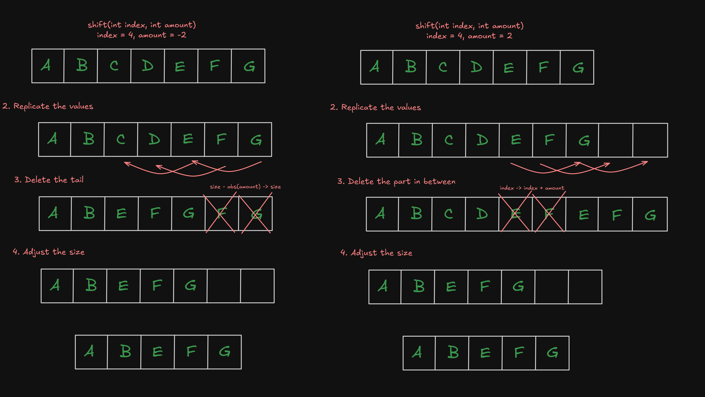
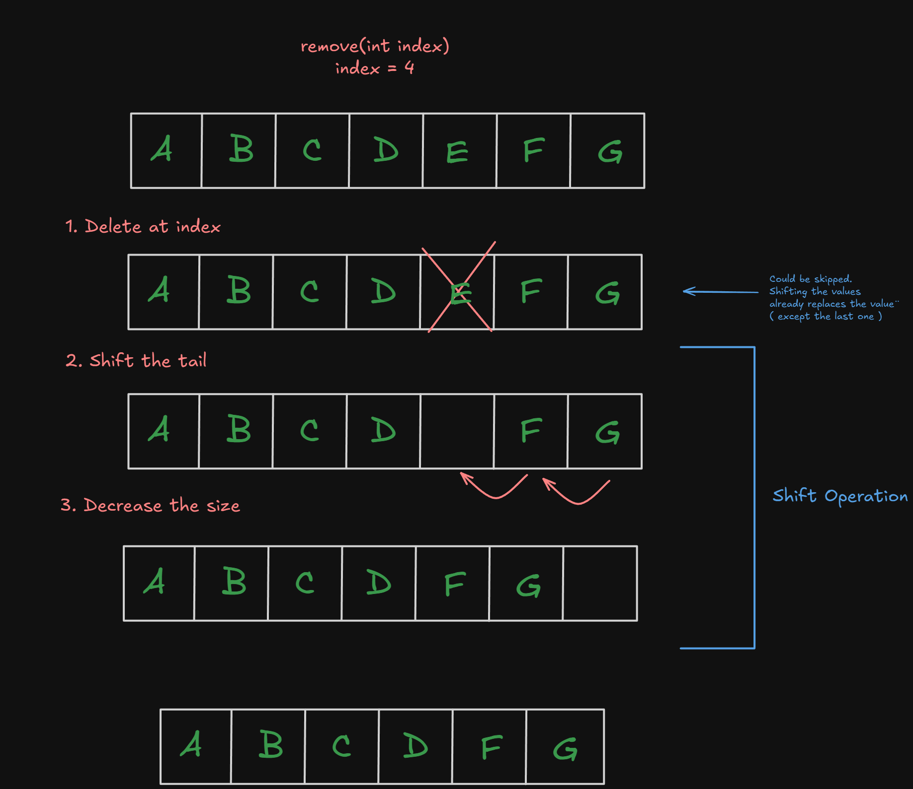

# Resources

There useful images of describing how some operations works.

For now there is just list shifting and removing

This is mainly for my future self, when I forget this. 

> There is also Drawing.excalidraw file. This contains whole canvas.
> 
> You open it using [excalidraw.com](https://excalidraw.com) or [obsidian plugin](https://github.com/zsviczian/obsidian-excalidraw-plugin)  

## List Shifting

## List removing
